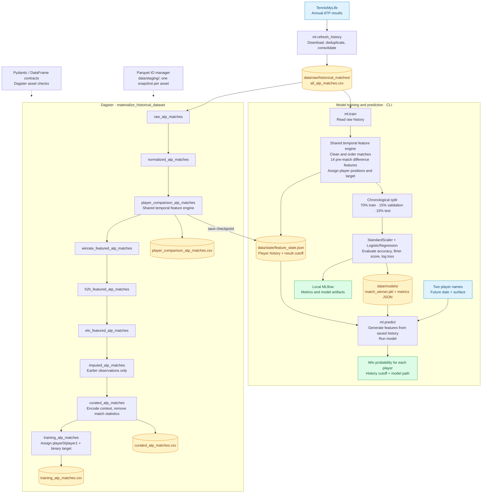

# Tennis match prediction — project diagram

Current implementation, verified against the CLI entry points and Dagster asset definitions.
Paths shown below use the default `data/` root; `TENNIS_DATA_DIR` can override it.

The CLI trains directly from raw history. Dagster publishes a wider dataset for inspection and experiments; its CSV exports are independent branches and are not inputs to the current `ml.train` command.

Both workflows use `feature_state.py` and shared comparison formulas. Features are computed before applying each match result. Prediction requires known players and a date after the saved history cutoff. Training and the Dagster comparison asset both write the default state checkpoint.

## Source references

- `ml/refresh_history.py` and `pipelines/historical_matches/tennis_my_life.py`: ingestion.
- `ml/train.py` and `ml/predict.py`: model fitting, evaluation, artifacts, and inference.
- `pipelines/historical_matches/feature_state.py`: chronological feature generation and persisted history.
- `pipelines/historical_matches/assets.py` and `defs.py`: asset dependencies, exports, job, checks, and Parquet persistence.
- `pipelines/shared/contracts.py` and `paths.py`: feature contracts and default storage paths.
