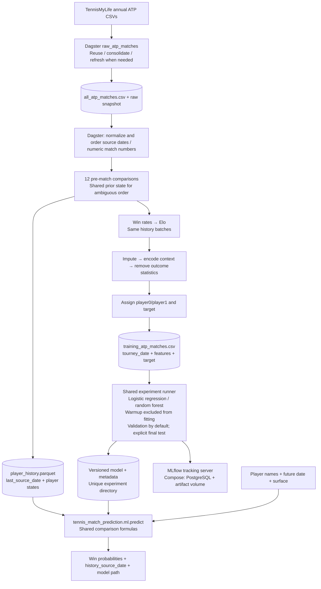

# Tennis match prediction — project diagram

The CLI trains from the Dagster-produced training CSV. Prediction reads the model
and the Dagster player-history snapshot. Comparison and curated CSV exports are
independent inspection branches.

`tourney_date` is preserved as a source date, whose granularity varies between
seasons and tournaments. Match numbers provide sequence within a tournament,
including rounds sharing a source date. Ambiguous groups share one prior state.
The pipeline does not infer match days or compute calendar workload windows.
See the history-order section in `README.md` for the ordering policy and limits.

Model artifacts require the `source_date_match_num` history order. Regenerate
snapshots, exports and models after this schema change; old formats are rejected.
